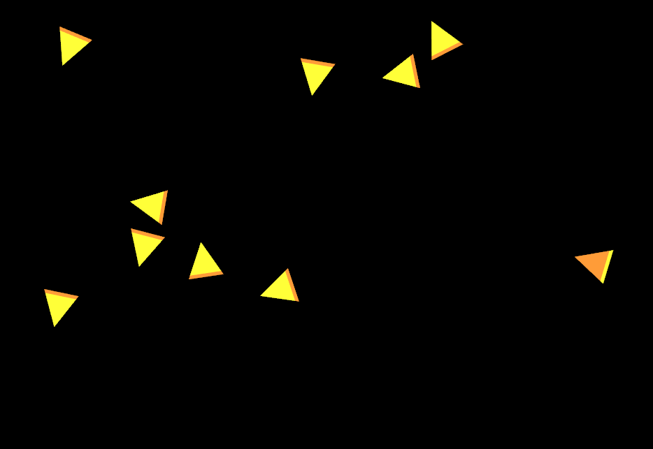

# rpsrtsrs

Rock-Paper-Scissors-Real-Time-Strategy game written in Rust :wink:

The game is to be played by at least 3 players. Like in Rock-Paper-Scissors,
each player has an advantage against one of the players and a disadvantage
against the other one (`A > B > C > A`).

The user therefore has to decide whether to defend his units against the
stronger user for survival, or whether to attack the weaker user for fame and
glory.

Two units (represented as triangles) can be combined to a building (a square).
In that form, they cannot attack anymore, but have a defense bonus.

[Development Docs](http://coredump-ch.github.io/rpsrtsrs/)

## Prequisites

 * SDL 2 (`libsdl2-dev` on Ubuntu)
 * FreeType (`libfreetype6-dev` on Ubuntu)
 * Rust version 1.8.0 or higher

## Building

### Linux

Just run

    $ cargo build

To build with the default configuration. If you want to change the window
backend use any of the following:

    $ cargo build --no-default-features --features include_glutin
    $ cargo build --no-default-features --features include_glfw
    $ cargo build --no-default-features --features include_sdl2

### Windows

You will need to install [freetype](https://github.com/PistonDevelopers/freetype-sys#for-windows-users)

## Running

If everything built fine you can use cargo to run the client or the server:

    $ cargo run --bin client
    $ cargo run --bin server

## Ideas

See [ideas](ideas.md)

## State Machine

This is the state machine on the Server:

    +-------+   +-----------+   +----------------------------+
    |*start*+--->ClientHello+--->ServerHello(ClientId, World)+-+
    +-------+   +-----------+   +----------------------------+ |
                                                               |
                +-----------+                                  |
                |*connected*<----------------------------------+--+-+
                ++-+--------+                                     | |
                 | |                                              | |
                 | | +----------------+   +---------------------+ | |
                 | +->Command(Command)+--->UpdateGamestate(Game)+-+ |
                 |   +----------------+   +---------------------+   |
                 |                                                  |
                 |   +-------------------------+                    |
                 +--->ClientReconnect(ClientId)+--------------------+
                     +-------------------------+

- Initially, the server waits for a `ClientHello` message.
- It responds with a `ServerHello` message that contains the client ID that can
  be used by the client for reconnecting with a `ClientReconnect` message when
  the connection was lost.
- Then the server enters a loop and waits for a `Command` from the client. When
  such a command results in a world change, the world is sent back to the client
  as an `UpdateGamestate` message.
